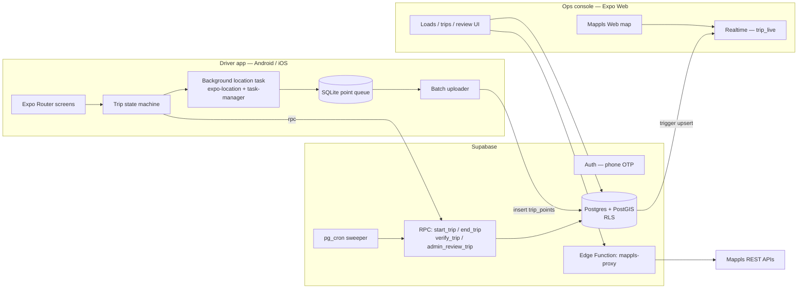

# 03 — Technical Requirements Document (Phase 1)

## 1. Architecture


## 2. Stack
| Layer | Choice | Why |
|---|---|---|
| App framework | Expo (latest stable SDK), React Native, TypeScript strict | One codebase for Android, iOS, web |
| Routing | Expo Router | File-based, works on web + native, typed routes |
| Build | EAS **development builds** (not Expo Go) | Mappls is a native module |
| Map (native) | `mappls-map-react-native` | Mappls official RN SDK |
| Map (web) | Mappls Web Maps JS SDK | Official web SDK; same map provider everywhere |
| Location | `expo-location`, `expo-task-manager` | Free, maintained, background + foreground service |
| Local storage | `expo-sqlite` (queue), `expo-secure-store` (session) | Durable offline queue |
| Server state | TanStack Query | Caching, retries |
| Client state | Zustand | Tiny, persistent tracking state |
| Forms/validation | react-hook-form + zod | Shared schemas |
| Backend | Supabase: Postgres 15+ w/ PostGIS, Auth, Realtime, Edge Functions (Deno), pg_cron | Required by client; geo maths in SQL |
| Monitoring | Sentry (`@sentry/react-native`) | Crash + performance |
| CI | GitHub Actions: typecheck, lint, unit tests, `supabase test db` | Free |

## 3. Repository structure
```
app/
  _layout.tsx               # imports src/tracking/task.ts FIRST, session + role gate
  (auth)/sign-in.tsx, verify.tsx
  (onboarding)/permissions.tsx, battery.tsx
  (driver)/_layout.tsx      # tabs: Trips, History, Profile
  (driver)/index.tsx, trips/[id].tsx, trips/[id]/live.tsx, history.tsx, profile.tsx
  (console)/_layout.tsx     # web sidebar layout, admin only
  (console)/index.tsx, loads/…, trips/…, review/…, drivers/…, vehicles/…
src/
  components/map/{types.ts, MapView.native.tsx, MapView.web.tsx, TruckMarker, RouteLine}
  features/{auth,loads,trips,review,live-map}/
  tracking/{task.ts, stateMachine.ts, queue.ts, uploader.ts, permissions.ts, config.ts}
  lib/{supabase.ts, mappls.ts, db.ts, geo.ts, sentry.ts}
  i18n/
supabase/
  migrations/0001_phase1_schema.sql
  functions/mappls-proxy/index.ts
  tests/*.sql               # pgTAP RLS + verification tests
```

## 4. Tracking engine (the heart of Phase 1)

### 4.1 Driver trip state machine (client)
```
IDLE ──(tap Start, geofence ok, rpc start_trip ok)──▶ TRACKING
TRACKING ──(tap End)──▶ ENDING (flush queue) ──(rpc end_trip ok)──▶ ENDED
ENDING ──(offline)──▶ ENDED_PENDING_SYNC ──(online, flush + rpc)──▶ ENDED
TRACKING ──(app killed / phone reboot)──▶ on next launch: read persisted state → restart location updates
```
Persist `{tripId, state, nextSeq, startedAt, endedAt?}` in SQLite (not just memory).

### 4.2 Location updates
```ts
// src/tracking/config.ts
export const TRACKING_OPTIONS = {
  accuracy: Location.Accuracy.BestForNavigation,
  timeInterval: 10_000,        // Android: ~10 s
  distanceInterval: 25,        // metres
  pausesUpdatesAutomatically: false,
  activityType: Location.ActivityType.AutomotiveNavigation,
  showsBackgroundLocationIndicator: true,
  foregroundService: {
    notificationTitle: 'Namma Lorry trip in progress',
    notificationBody: 'Recording your trip for verified experience',
    killServiceOnDestroy: false,
  },
};
```
- `TaskManager.defineTask(TRIP_LOCATION_TASK, …)` lives in `src/tracking/task.ts` and is imported at the top of `app/_layout.tsx`.
- The task only writes to SQLite and returns. Upload happens separately (uploader), so a slow network never blocks GPS capture.
- `app.json` plugin: `expo-location` with `isAndroidBackgroundLocationEnabled`, `isAndroidForegroundServiceEnabled`, `isIosBackgroundLocationEnabled` and clear permission strings (see doc 09).

### 4.3 Local queue (SQLite)
```sql
create table point_queue(
  trip_id text, seq integer, recorded_at text, lat real, lng real,
  accuracy_m real, speed_mps real, heading real, altitude_m real, is_mocked integer,
  uploaded integer default 0, primary key(trip_id, seq));
```
- `seq` increments per trip and is persisted, so restarts never reuse a number.
- Uploader: every 30 s (or on reconnect / app foreground), take ≤ 200 un-uploaded rows, `upsert` into `trip_points` with `onConflict: 'trip_id,seq', ignoreDuplicates: true`, mark uploaded. Exponential backoff on failure.
- Delete uploaded rows after the trip reaches a final status.

### 4.4 Web limitation
Browsers can't track in the background, so web never runs trips. Web = console.

## 5. Map abstraction
```ts
// src/components/map/types.ts
export type LatLng = { lat: number; lng: number };
export interface AppMapProps {
  center?: LatLng; zoom?: number;
  markers?: { id: string; position: LatLng; kind: 'truck'|'pickup'|'drop'; heading?: number }[];
  polylines?: { id: string; path: LatLng[]; kind: 'actual'|'planned' }[];
  circles?: { id: string; center: LatLng; radiusM: number }[];   // geofences
  onPress?: (p: LatLng) => void;
  fitToContent?: boolean;
}
```
`MapView.native.tsx` implements it with `MapplsGL.MapView / Camera / ShapeSource / LineLayer / PointAnnotation`; `MapView.web.tsx` with the Mappls Web SDK loaded once via a script loader. Screens import only `@/components/map/MapView`.
**Coordinate order:** Mappls native (like Mapbox GL) uses `[lng, lat]`; our app type uses `{lat,lng}` — convert only inside the map components.

## 6. Backend
Full SQL: `supabase/migrations/0001_phase1_schema.sql`.

| Table | Purpose | Written by |
|---|---|---|
| `profiles` | user + role | admin / signup trigger |
| `vehicles` | registration, type, owner | admin |
| `loads` | load code, pickup/drop + radius, planned distance | admin |
| `trips` | one driver + vehicle per load; status, times, distance, reasons | RPCs only |
| `trip_points` | raw GPS points | driver (RLS: own trip, in progress / awaiting upload) |
| `trip_live` | latest point per trip (realtime) | trigger |
| `trip_events` | audit log (started, ended, reviewed, flags) | RPCs |
| `driver_stats` | verified trips & km | `verify_trip` / review only |

**RPCs (security definer, `search_path = public`):** `start_trip`, `end_trip`, `admin_review_trip`, `verify_trip` (internal; not granted to clients).
**Trigger:** after insert on `trip_points` → upsert `trip_live`; if the trip is `completed` and all expected points have arrived → `verify_trip`.
**pg_cron:** every 15 min, verify trips `completed` for > 6 h (missing points become a `MISSING_POINTS` reason).
**Edge function `mappls-proxy`:** holds Mappls client secret; exposes `autosuggest`, `geocode`, `reverse-geocode`, `distance` to authenticated admins. Caches responses where allowed.

## 7. Realtime
Console subscribes to `postgres_changes` on `trip_live` (all active trips for dashboard; `filter: trip_id=eq.<id>` on trip page). RLS applies to realtime, so owners/shippers later see only their rows. Polyline history loads once from `trip_points`, then appends realtime points.

## 8. Security (details in doc 09)
- RLS on every table; drivers have no `update/delete` on anything verification-related.
- Role is read via `public.my_role()`; drivers cannot change `profiles.role`.
- Map SDK key restricted by package / bundle / domain; REST secrets only in Edge Functions.
- Session stored with `expo-secure-store` on native.

## 9. Non-functional requirements
| Area | Requirement |
|---|---|
| Battery | ≤ ~8 %/hour extra drain on a mid-range Android at the default config (measure in W6) |
| Data | ≤ ~2 MB per 10-hour trip upload |
| Latency | Live delay ≤ 60 s with network |
| Durability | 0 lost points across offline periods and app restarts |
| Scale (Phase 1) | 50 concurrent active trips on Supabase free/pro tier |
| Storage | ~3,600 points per 10-h trip; plan retention (downsample raw points older than N months — client decision) |
| Accessibility | Large tap targets (≥ 48 dp) on Start/End; works one-handed; high contrast |

## 10. Environments
`development` (local Supabase via CLI) → `staging` (Supabase project #1) → `production` (project #2). EAS profiles: `development`, `preview` (internal testing APK/TestFlight), `production`.

## 11. Known Phase 1 limitations (tell the client)
- GPS proves where the **phone** went, not who drove. Phase 2 adds selfie/delivery OTP.
- Root/jailbreak + advanced spoofers can defeat mock-location detection; Phase 2 adds Play Integrity / App Attest.
- iOS can suspend updates in rare low-power situations; gaps are flagged, not hidden.
