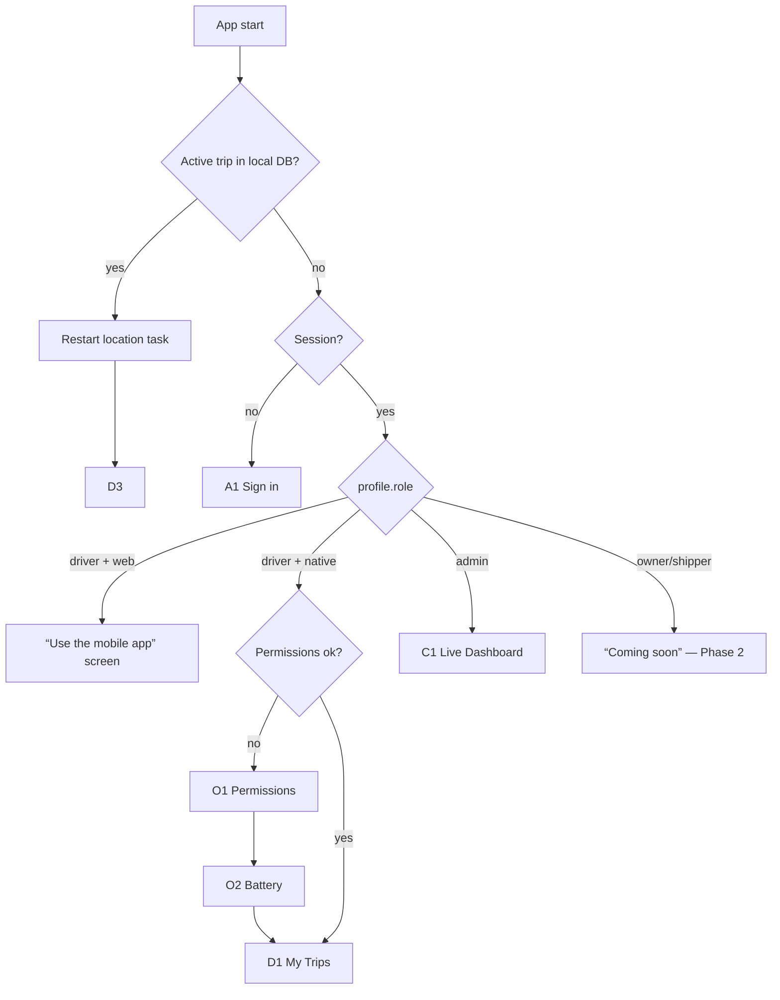
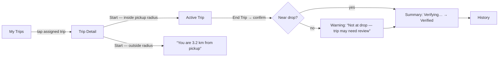

# 04 — Screen Navigation (Phase 1)

## 1. Route tree (Expo Router)
```
app/
├─ _layout.tsx                  Root: load session → decide group
├─ (auth)/
│   ├─ sign-in.tsx              A1 Phone number
│   └─ verify.tsx               A2 OTP
├─ (onboarding)/                driver, first launch or permission lost
│   ├─ permissions.tsx          O1 Location (precise + always), notifications
│   └─ battery.tsx              O2 Battery optimisation (Android only)
├─ (driver)/                    role = driver, native only
│   ├─ _layout.tsx              Bottom tabs: Trips · History · Profile
│   ├─ index.tsx                D1 My Trips (assigned + active)
│   ├─ trips/[id].tsx           D2 Trip Detail / Start
│   ├─ trips/[id]/live.tsx      D3 Active Trip (tracking)
│   ├─ trips/[id]/summary.tsx   D4 Trip Summary / Verification result
│   ├─ history.tsx              D5 History
│   └─ profile.tsx              D6 Profile & Stats
└─ (console)/                   role = admin, web (also works on tablet)
    ├─ _layout.tsx              Sidebar: Live · Loads · Trips · Review · Drivers · Vehicles
    ├─ index.tsx                C1 Live Dashboard
    ├─ loads/index.tsx          C2 Loads list
    ├─ loads/new.tsx            C3 Create Load
    ├─ loads/[id].tsx           C4 Load detail + Assign
    ├─ trips/index.tsx          C5 Trips list
    ├─ trips/[id].tsx           C6 Trip detail (live / replay)
    ├─ review/index.tsx         C7 Review queue
    ├─ review/[id].tsx          C8 Review decision
    ├─ drivers/index.tsx        C9 Drivers (+ add)
    └─ vehicles/index.tsx       C10 Vehicles (+ add)
```

## 2. Root routing logic


## 3. Driver trip flow


## 4. Screen specs
Each screen lists purpose · key elements · states. All driver screens: large buttons, one primary action, works in bright sunlight.

**A1 Sign in** — phone number with +91 fixed, "Send OTP". States: invalid number, unregistered number ("Contact Namma Lorry to register"), rate-limited.
**A2 Verify** — 6-digit OTP, auto-read on Android if available, resend timer 30 s. States: wrong code, expired.

**O1 Permissions** — why we need location (trip only, not all day), buttons in order: *Allow precise location* → *Allow all the time* (opens system settings when needed) → *Allow notifications*. Shows ✅ per permission. Blocks continuation until background location is granted.
**O2 Battery (Android)** — detect manufacturer; show brand-specific steps (Xiaomi "No restrictions", Vivo/Oppo/Realme "Allow background activity"), button to open settings. Skippable but reminded on D2.

**D1 My Trips** — cards: Load ID, pickup → drop, material, vehicle no., status chip. Active trip pinned on top with "Resume". Empty: "No trips assigned yet". Pull to refresh.
**D2 Trip Detail / Start** — Mappls map with pickup & drop pins and pickup geofence circle, driver blue dot, live "distance to pickup". Big **START TRIP** (enabled only inside radius + permissions OK). States: loading GPS, poor accuracy (> 50 m: "Waiting for better GPS"), outside radius, permission missing (link to O1), network error (retry).
**D3 Active Trip** — map following the truck, drawn route so far, elapsed time, km so far (labelled "approximate — final km verified by Namma Lorry"), sync status ("All synced" / "142 points waiting — will upload when online"), GPS status. **END TRIP** requires a confirm dialog. Back button does not stop tracking.
**D4 Summary** — status: *Verifying…* (poll/realtime) → *Verified ✅* with official km & duration, or *Needs review* with plain-language reasons from doc 08. Offline end: "Trip ended — will verify when you're online".
**D5 History** — list of trips with status chips, filter by status. Tap → D4.
**D6 Profile & Stats** — name, phone, verified trips, verified km, first/last verified trip date (all read-only, from `driver_stats`). Language setting, permissions check, sign out (blocked while a trip is active).

**C1 Live Dashboard** — full-width Mappls map with all `in_progress` trucks (marker rotated by heading), side list: vehicle, driver, load, last update ("45 s ago", red if > 15 min). Click → C6.
**C2 Loads list** — table: Load ID, pickup, drop, created, status (unassigned/assigned/in trip/done). Search by Load ID.
**C3 Create Load** — pickup & drop fields with Mappls autosuggest + map pin adjust, radius slider (100–2,000 m, default 500), material, weight, notes. On save: planned distance fetched via `mappls-proxy`, Load ID generated server-side.
**C4 Load detail + Assign** — map with both geofences, planned route, **Assign** form: driver (searchable), vehicle. Shows resulting trip.
**C5 Trips list** — filters: status, driver, date. Columns: Load ID, driver, vehicle, started, ended, km (verified), status.
**C6 Trip detail** — map with actual route (and planned route dashed), start/end markers, event timeline (started, gaps, ended, verification), verification reasons, P1 replay slider. Live-updating while in progress.
**C7 Review queue** — `needs_review` trips, oldest first, reason chips.
**C8 Review decision** — C6 view + Approve / Reject with mandatory note.
**C9 Drivers** — list + "Add driver" (name, phone → creates profile, role driver). Shows verified stats.
**C10 Vehicles** — list + "Add vehicle" (registration no., type: e.g. 407 / 14 ft / 17 ft / 19 ft / 20 ft / 22 ft / 24 ft / multi-axle, owner).
